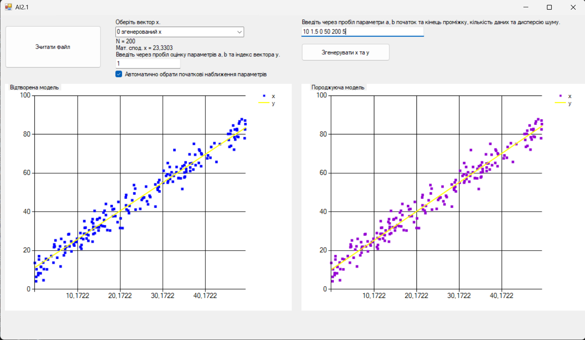
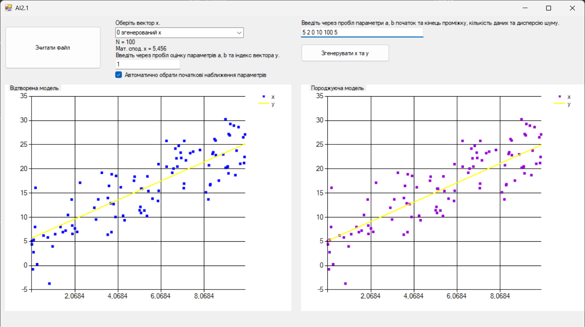
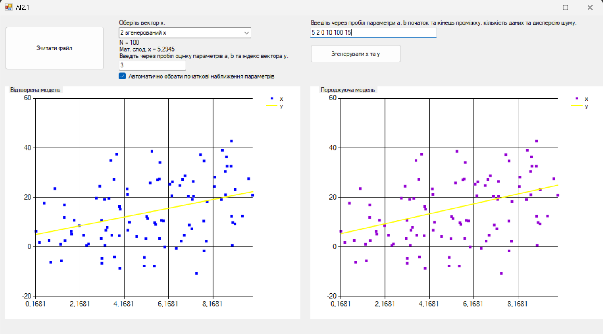
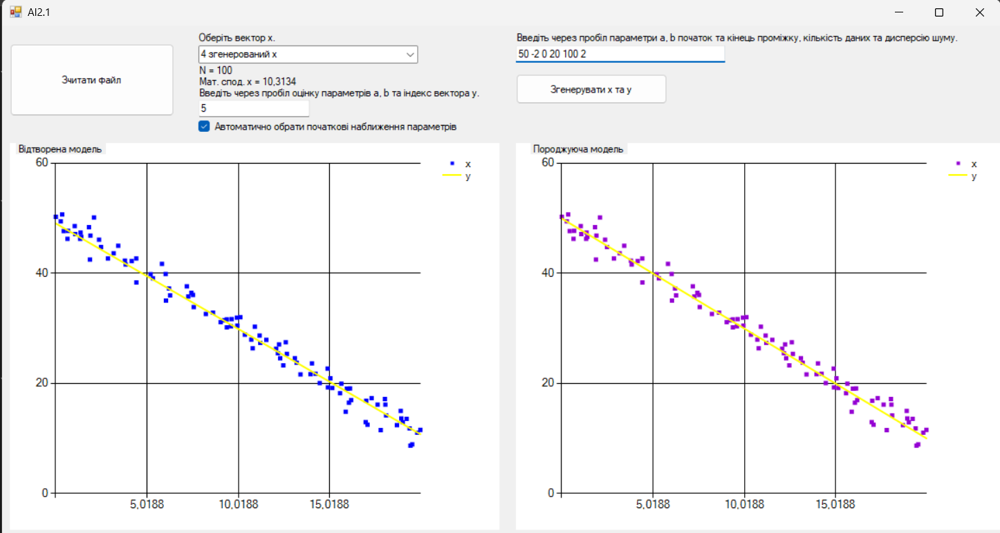

# Linear Regression WinForms

Desktop application developed in **C# (WinForms)** for performing **linear regression analysis**, generating synthetic datasets, and visualizing model fitting.

---

## Overview

This project demonstrates the implementation of a **linear regression model** using **gradient descent**.

The application allows:
- generating synthetic datasets with controllable noise
- restoring the regression model from data
- comparing the original and reconstructed models
- visualizing results on charts

---

## Features

- 📊 Synthetic data generation (x, y)
- 📈 Linear regression using gradient descent
- 📉 Visualization of:
  - original data
  - reconstructed model
- ⚙️ Adjustable parameters:
  - regression coefficients (a, b)
  - range of x values
  - dataset size
  - noise level (standard deviation)
- 🔍 Analysis of model behavior under different noise levels

---

## Mathematical Model

The data is generated using the equation:
y = a + b * x + ε

Where:
- `a` — intercept  
- `b` — slope  
- `ε` — random noise  

The model is reconstructed by minimizing the loss function:
S = Σ (y - a - b*x)²

using **gradient descent**.

---

## Application Preview

### Low noise (accurate model fit)

### Medium noise

### High noise (poor fit)

### Negative trend

---

## Example Parameters

You can test the model using the following inputs:
5 2 0 10 100 1 // low noise
5 2 0 10 100 5 // medium noise
5 2 0 10 100 15 // high noise
50 -2 0 20 100 2 // negative trend

Format: a b xmin xmax n standardDeviation

---

## Technologies Used

- C#
- .NET (WinForms)
- Data visualization (System.Windows.Forms.DataVisualization)
- Gradient Descent optimization

---

## What This Project Demonstrates

- implementation of a mathematical model in code
- understanding of regression analysis
- data generation and simulation
- visualization of analytical results
- ability to test models under different conditions

---

## Future Improvements

- CSV import/export
- calculation of R², MSE, RMSE
- support for multiple regression
- UI improvements
- saving results

---

## 🇺🇦 Опис українською

Це десктопний застосунок на C#, який реалізує метод лінійної регресії з використанням градієнтного спуску.

Програма дозволяє:
- генерувати тестові дані з шумом
- відновлювати модель за даними
- візуалізувати результати
- аналізувати вплив шуму на якість моделі

Проєкт демонструє навички роботи з:
- математичним моделюванням
- аналізом даних
- C# та WinForms
- візуалізацією результатів
